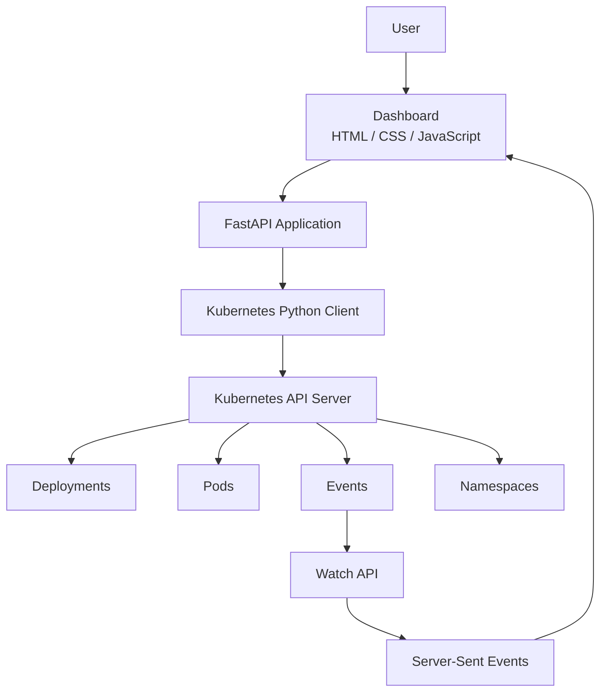
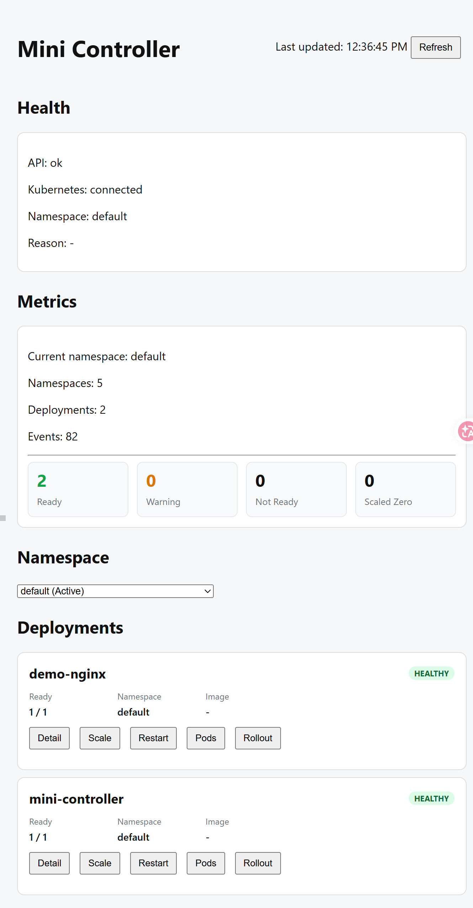
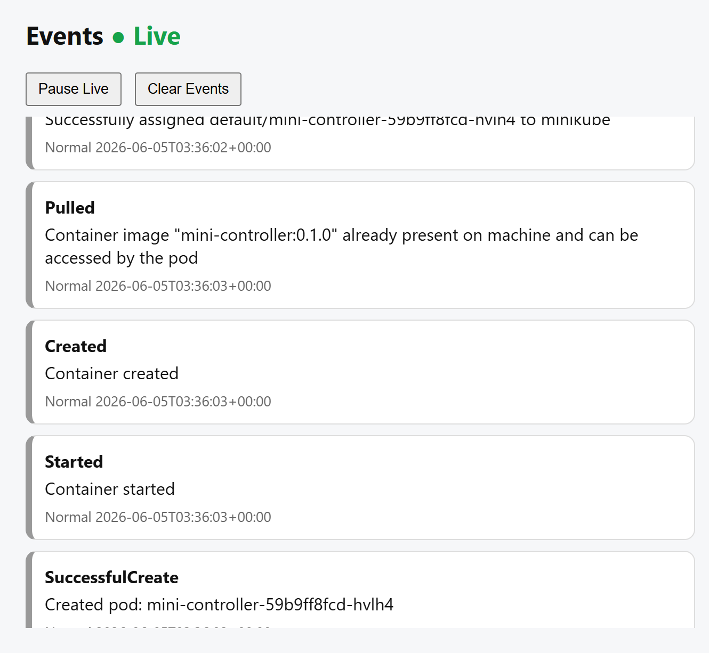

# Mini Controller

Mini Controller is a lightweight Kubernetes Operations Dashboard built with FastAPI and the Kubernetes Python Client.

It provides deployment management, pod inspection, rollout monitoring, RBAC-secured cluster access, and real-time Kubernetes event streaming via Server-Sent Events (SSE).

---
## Features

### Health

* ✔ API health endpoint
* ✔ Kubernetes connectivity health endpoint

### Deployments

* ✔ List deployments
* ✔ Get deployment details
* ✔ Scale deployments
* ✔ Restart deployments
* ✔ Deployment rollout status

### Pods

* ✔ List deployment pods
* ✔ Read pod logs

### Events

* ✔ List Kubernetes events
* ✔ Watch Kubernetes events (SSE)
* ✔ Event deduplication
* ✔ Real-time event updates

### Namespaces

* ✔ List namespaces

### Dashboard

* ✔ Web dashboard
* ✔ Live event feed
* ✔ Health panel
* ✔ Metrics panel
* ✔ Namespace selector
* ✔ Deployment actions
* ✔ Deployment status badges
* ✔ Pod status badges
* ✔ Cluster summary panel
* ✔ Event deduplication
* ✔ Manual refresh
* ✔ Pause live events

### Kubernetes Operations

* ✔ Runs inside Kubernetes
* ✔ Uses ServiceAccount + RBAC
* ✔ In-cluster configuration
* ✔ Deployment scaling
* ✔ Deployment restart
* ✔ Rollout monitoring
* ✔ Real-time event streaming
* ✔ Automatic SSE reconnection

---

## Architecture


The dashboard runs inside Kubernetes and communicates with the Kubernetes API Server through the Kubernetes Python Client using a ServiceAccount and RBAC permissions.

---


## Screenshots

### Dashboard



### Live Events



---

## Project Structure

```
mini-controller/
├── main.py
└── app/
    ├── config.py
    ├── kube.py
    ├── schemas.py
    ├── serializers.py
    ├── services.py
    └── routers/
        ├── health.py
        ├── deployments.py
        ├── pods.py
        ├── events.py
        ├── namespaces.py
        └── watch.py
```

---

## Layer Responsibilities

### Routers — `routers/`
Handle HTTP requests and responses.
- Route definitions
- Request parsing
- Response generation

### Services — `services.py`
Contain deployment and pod operations.
- Deployment queries
- Scaling
- Restarting
- Pod lookup

### Schemas — `schemas.py`
Request validation models.
- Input validation
- API request contracts

### Serializers — `serializers.py`
Transform Kubernetes objects into API responses.
- Deployment serialization
- Pod serialization

### Kubernetes Layer — `kube.py`
Shared Kubernetes client configuration and helpers.
- Kubernetes API clients
- Namespace validation
- Common helpers

---

## API Endpoints

### Health
```
GET /health
GET /health/kubernetes
```

### Deployments
```
GET  /deployments
GET  /deployments/{name}
POST /deployments/{name}/scale
POST /deployments/{name}/restart
GET  /deployments/{name}/rollout
```

### Pods
```
GET /deployments/{name}/pods
GET /pods/{name}/logs
```

### Events
```
GET /events
```

### Namespaces
```
GET /namespaces
```

### Watch
```
GET /watch/events
```
---


## Example

Scale a deployment:

```powershell
Invoke-RestMethod `
  -Uri "http://localhost:8000/deployments/worker/scale?namespace=default" `
  -Method Post `
  -ContentType "application/json" `
  -Body '{"replicas":3}'
```

---

## Kubernetes Deployment

Mini Controller can run inside a Kubernetes cluster and control Kubernetes resources through the Kubernetes API.

### Build image

```bash
docker build -t mini-controller:0.1.0 .
```

### Load image into Minikube

```bash
minikube image load mini-controller:0.1.0
```

### Deploy

```bash
kubectl apply -f k8s/mini-controller-rbac.yaml
kubectl apply -f k8s/mini-controller-deployment.yaml
kubectl apply -f k8s/mini-controller-service.yaml
```

### Access Swagger UI

```bash
kubectl port-forward service/mini-controller 8001:8000
```

Open: http://localhost:8001/docs

### Verify RBAC

```bash
kubectl auth can-i list deployments \
  --as=system:serviceaccount:default:mini-controller
```

Expected:

```
yes
```

---

## What I Learned

- FastAPI routing
- Pydantic request validation
- Kubernetes Python Client
- Deployment scaling and restart operations
- Namespace validation
- API error handling
- Layered backend architecture
- Service layer refactoring
- Difference between list and watch operations
- Server-Sent Events with FastAPI StreamingResponse
- RBAC verbs for watch permissions
- Debugging ImagePullBackOff and ErrImagePull events
- Minikube local image loading workflow
- Kubernetes RBAC and ServiceAccounts
- Kubernetes Watch API
- Server-Sent Events (SSE)
- Deployment lifecycle management
- In-cluster Kubernetes applications
- Real-time operations dashboard design